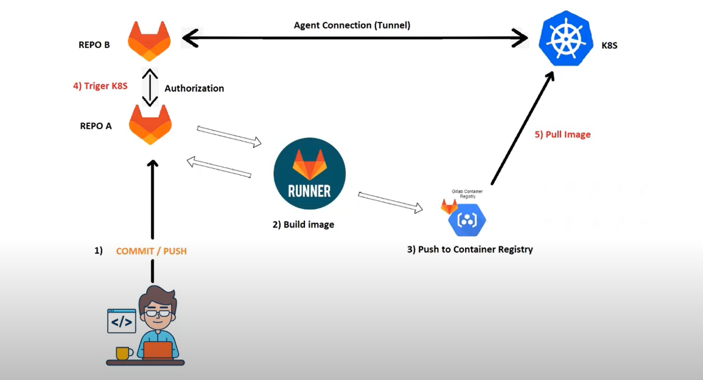

# Modern Login Web App Deployment on Minikube with GitLab CI/CD

This project provides a detailed, step-by-step guide for deploying a modern login web app on Minikube using GitLab CI/CD. We assumes that you have already containerized the application and that your GitLab repository is set up for CI/CD.
This guide walks you through deploying a modern login web app on **Minikube** using **GitLab CI/CD** for continuous integration and deployment.

## Prerequisites

1. **Minikube** installed on your local machine ([Installation Guide](https://minikube.sigs.k8s.io/docs/start/)).
2. **kubectl** configured to interact with Minikube.
3. **Docker** installed and configured.
4. **GitLab Repository** with CI/CD enabled.
5. **GitLab Kubernetes Agent** configured in your GitLab project.
6. **Kubernetes manifests** (`Deployment`, `Service`, and optional `Ingress`) for deploying the app.

---

## Project Structure



```
my-login-app/
├── .gitlab-ci.yml          # GitLab CI/CD configuration file
├── .gitlab/agents/
│   └── minikube-agent/
│       └── config.yaml     # GitLab Agent configuration
├── k8s/
│   ├── deployment.yaml     # Kubernetes Deployment manifest
│   ├── service.yaml        # Kubernetes Service manifest
│   └── ingress.yaml        # Kubernetes Ingress manifest (optional)
├── Dockerfile              # Dockerfile for the application
├── src/                    # Source code of the login app
└── README.md               # Project documentation
```

---

## Step 1: Write Your Dockerfile

The Dockerfile is used to build a container image of your application. Here’s an example Dockerfile for a Node.js app:

```dockerfile
FROM nginx:latest

COPY src/ /usr/share/nginx/html

RUN chmod -R 755 /usr/share/nginx/html
```

---

## Step 2: Create Kubernetes Manifests files

---

Register the agent with GitLab:
a. Create a secret that minikube will use to access that app image from the gitlab repo

```bash
kubectl create secret docker-registry app-secret --docker-server=registry.gitlab.com
--docker-username='' --docker-password='' --dry-run=client -o yaml > secret.yaml

kubectl apply -f secret.yaml
```

```yaml
apiVersion: v1
data:
.dockerconfigjson: <connection-id>=
kind: Secret
metadata:
name: app-secret
type: kubernetes.io/dockerconfigjson
```

4. Configure the pod file

```bash
kubectl run login-app --image=<container registry path>/<name of the image>:v1 --dry-run=client -o yaml > pod.yaml

kubectl apply -f pod.yaml
```

```yaml
apiVersion: v1
kind: Pod
metadata:
  creationTimestamp: null
  labels:
    run: login-app
  name: login-app
spec:
  containers:
    - image: registry.gitlab.com/id/k8s-data/sample:v1
      name: login-app
  restartPolicy: Always
  imagePullSecrets:
    - name: app-secret
```

### service

```bash
kubectl create svc nodeport login-svc --tcp=8081:8081 --dry-run=client -o yaml > login-svc.yaml

kubectl apply -f login-svc.yaml
```

```yaml
apiVersion: v1
kind: Service
metadata:
  creationTimestamp: null
  labels:
    app: login-svc
  name: login-svc
spec:
  ports:
    - name: login-svc
      port: 8081
      protocol: TCP
      targetPort: 8081
  selector:
    run: login-app
  type: NodePort
status:
  loadBalancer: {}
```

kubectl apply -f login-svc

Then go to `http://<Minikube_IP>:<NodePort>`

## Step 3: Enable the GitLab Kubernetes Agent

You need to create 2 gitlap project.
a. One project is to create an agent and establish Connection to minikube

1. Create a project call**k8s-connections**
2. In GitLab, go to **Infrastructure > Kubernetes clusters** in your project.
3. Click **Connect a cluster (agent)**, then **Install GitLab Agent**.
4. Enter an **Agent name** (e.g., `minikube-agent`).
5. GitLab will provide a configuration snippet. Save it as `.gitlab/agents/minikube-agent/config.yaml` in your project:

   ```yaml
   # .gitlab/agents/minikube-agent/config.yaml
   gitlab:
     project: <YOUR-GITLAB-NAMESPACE>/<YOUR-PROJECT-NAME>
   ```

---

b. The other is to host the data files.

1. Create a project call **k8s-data**
2. push all the file from local to the gitlab repository

```md
git status
git add .
git commit
git push origin main
```

## Step 4: Install the GitLab Agent in Minikube

1. Start Minikube if it's not already running:

   ```bash
   minikube start
   ```

2. Install the GitLab Agent in Minikube:

   ```bash

    helm repo add gitlab https://charts.gitlab.io
    helm repo update
    helm upgrade --install k8s-connection gitlab/gitlab-agent \
    --namespace gitlab-agent-k8s-connection \
    --create-namespace \
    --set config.token=<token-id>> \
    --set config.kasAddress=wss://kas.gitlab.com
   ```

**Make sure helm is installed**

3.

## Step 5: Configure GitLab CI/ CD Lets do the above through gitlab cicd.

- Push all the above files to gitlab repo (i.e (pod.yaml, app-secret.yaml, login-svc.yaml))

Update your `.gitlab-ci.yml` file to use the GitLab Kubernetes Agent for secure deployment.

### .gitlab-ci.yml

```yml
variables:
  KUBE_CONTEXT: <gitlab-username>//k8s-connection:k8s-connection

stages:
  - build
  - deploy

# variables:
#   CI_REGISTRY_IMAGE: $CI_REGISTRY_IMGE/login-app

build_image:
  image: docker
  stage: build
  services:
    - docker:dind
  script:
    - docker login -u $CI_REGISTRY_USER -p $CI_REGISTRY_PASSWORD $CI_REGISTRY
    - docker build -t $CI_REGISTRY/<gitlab-username>/k8s-data/sample:v1 .
    - docker push $CI_REGISTRY/<gitlab-username>/k8s-data/sample:v1
    - echo "Image build successfully"

deploy_project:
  stage: deploy
  image:
    name: bitnami/kubectl:latest
    entrypoint: [""]
  script:
    - kubectl config use-context $KUBE_CONTEXT
    - kubectl get pods
    - kubectl get node -o wide
    - echo "Deployment LOGIN-App to k8s"
    - ls $CI_PROJECT_DIR/k8s-files
    - kubectl apply -f $CI_PROJECT_DIR/k8s-files/.
    - kubectl get pods
    - kubectl get svc
```

### .config.yml

This is the minikube connection agent you created earlier.
you need to configure that to give access from gitlab to minikube

```yml
ci_access:
  projects:
    - id: <gitlab-username>/k8s-data
```

This `.gitlab-ci.yml` file sets up:

- A **build stage** that builds and pushes the Docker image to the GitLab Container Registry.
- A **deploy stage** that applies Kubernetes manifests using the GitLab Kubernetes Agent.

---

## Step 6: Test Your CI/CD Pipeline

1. **Commit and push** your changes to GitLab.
2. Go to **CI/CD > Pipelines** in GitLab to see the running pipeline.
3. Check the logs in each stage to confirm that the build and deployment succeed.

---

## Step 7: Access Your Application

After deployment, access your application:

- **NodePort Service**: If using a NodePort, get the service’s port:

  ```bash
  kubectl get svc login-app-service
  ```

  Then go to `http://<Minikube_IP>:<NodePort>`.

- **Ingress**: If you set up Ingress with a hostname like `login-app.local`, add an entry to your hosts file:
  ```bash
  echo "$(minikube ip) login-app.local" | sudo tee -a /etc/hosts
  ```
  Then go to `http://login-app.local`.

---

## Troubleshooting

- **Agent Connection Issues**: Ensure the agent is installed correctly in Minikube and that the token is accurate.
- **Pipeline Failures**: Review CI/CD logs for any errors during the build or deployment stages.
- **Ingress or Service Errors**: Verify that Ingress and Service configurations are correct and that necessary Minikube addons are enabled.

---

## Conclusion

This guide outlines the full process to securely deploy a modern login web app on Minikube using GitLab CI/CD and the GitLab Kubernetes Agent. This setup provides a secure, automated CI/CD pipeline for deploying to your local Kubernetes environment.

---

## License

This README provides a full guide for using the GitLab Kubernetes Agent to securely connect to Minikube and deploy an app with GitLab CI/CD. Update paths, image names, and domains as needed.
